<div align="center">

# ☠️ fsociety

### Interactive Cybersecurity Education Platform

*Learn to think like an attacker. Build the instincts of a defender.*

[](https://react.dev)
[](https://typescriptlang.org)
[](https://vitejs.dev)
[](https://tailwindcss.com)
[](https://xtermjs.org)

</div>

---

## What is this?

**fsociety** is a browser-based cybersecurity learning platform with a built-in hacking terminal. You don't read about attacks — you simulate them. From passive recon to lateral movement, each lesson is paired with a live lab where you run real commands against simulated targets.

The curriculum is structured around the **MITRE ATT&CK framework** and traces real-world nation-state attack chains — with Salt Typhoon's 2024 US telecom breach as the red thread through the entire course.

---

## Platform Overview

<table>
<tr>
<td width="50%">

**Lesson View** — Rich HTML content with AI-generated concept diagrams for every topic.

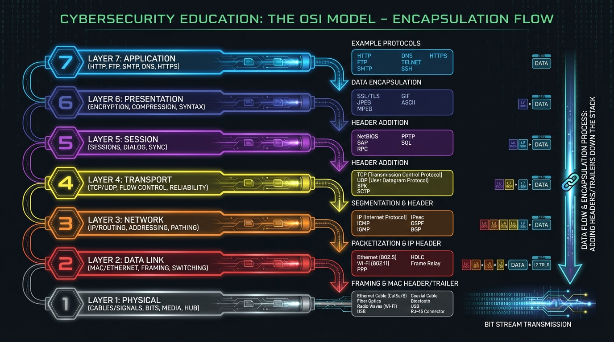

</td>
<td width="50%">

**Nmap Scan Visualization** — See what attackers see when they enumerate your network.

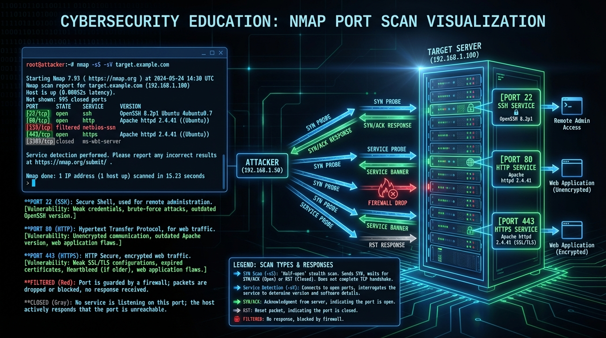

</td>
</tr>
<tr>
<td width="50%">

**Kill Chain Mapping** — Full ATT&CK chain reconstruction of Salt Typhoon's telecom breach.

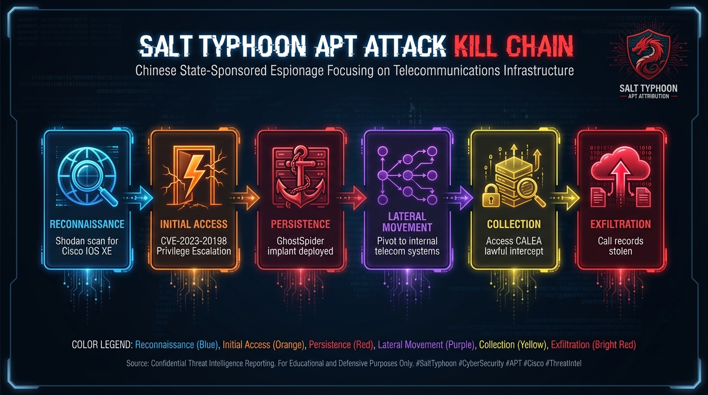

</td>
<td width="50%">

**Pass-the-Hash** — Step-by-step lateral movement using credential relay attacks.

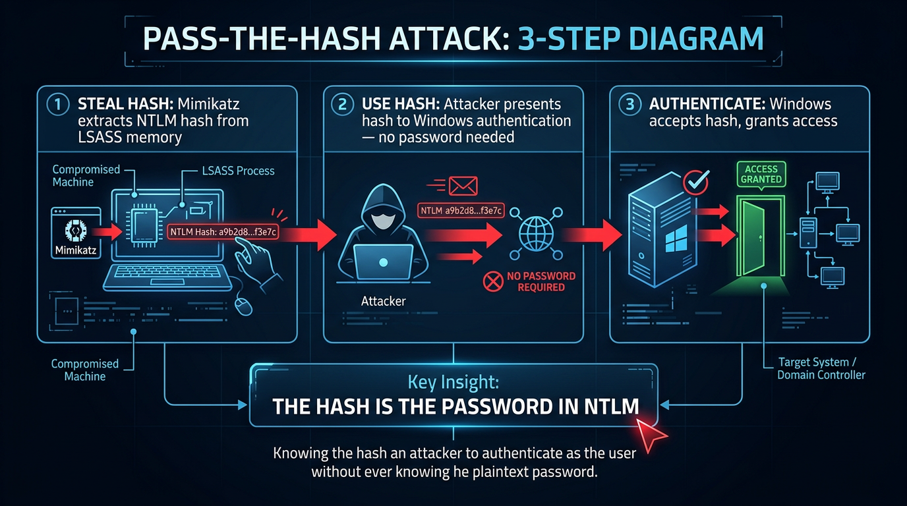

</td>
</tr>
</table>

---

## Curriculum

**24 lessons across 8 modules** — structured from fundamentals to nation-state tactics.

| Module | Level | Topics | MITRE Coverage |
|--------|-------|---------|----------------|
| 🔵 **Fundamentals** | Beginner | OSI model, TCP/IP, DNS, HTTP, Linux terminal | — |
| 🟢 **Recon & OSINT** | Beginner | Passive recon, Nmap, DNS zone transfers | T1592, T1593, T1046 |
| 🟡 **Initial Access** | Intermediate | Spear phishing, CVE exploitation, SQLi, XSS | T1566, T1190 |
| 🟠 **Persistence** | Intermediate | Web shells, scheduled tasks, rootkits | T1505.003, T1053, T1014 |
| 🔴 **Lateral Movement** | Advanced | LSASS dump, Mimikatz, Pass-the-Hash, SMB | T1003, T1558, T1021 |
| 🔴 **Exfiltration** | Advanced | Data staging, DNS tunneling, C2 beaconing | T1560, T1071, T1573 |
| 🟣 **Defense & Detection** | Advanced | SIEM/Sigma rules, network architecture, IR | — |
| ⚫ **APT Case Studies** | Expert | Salt Typhoon, APT41, Lazarus Group deep dives | Full chain |

> Total XP available: **4,300 XP**

---

## Hands-On Labs

Each lab drops you into a realistic hacking terminal with a mission checklist, auto-hints, and objective tracking saved to local storage.

| Lab | Topic | Difficulty | Key Commands |
|-----|-------|------------|-------------|
| `scenario-00` | First Recon | 🟢 Beginner | `whois`, `nmap`, `shodan` |
| `scenario-01` | DNS Zone Transfer | 🟢 Beginner | `dig AXFR`, `dnsrecon` |
| `scenario-02` | SQLi + File Upload | 🟡 Intermediate | `sqlmap`, `curl`, custom payloads |
| `scenario-03` | Hunt Web Shells | 🟡 Intermediate | `find`, `grep`, `md5sum` (defensive) |
| `scenario-04` | Pass-the-Hash → DC | 🔴 Advanced | `mimikatz`, `psexec`, `crackmapexec` |
| `scenario-05` | SOC Breach Response | 🟡 Intermediate | `splunk`, `sigma`, log analysis |
| `scenario-06` | Terminal Basics | 🟢 Beginner | 100 essential bash commands |

### Inside a Lab

```
┌─────────────────────────────────────────────────────────────┐
│  MISSION: DNS Reconnaissance                                │
│                                                             │
│  [ ] 1. Query the nameservers for corp.local               │
│  [✓] 2. Attempt a zone transfer                            │
│  [ ] 3. Enumerate subdomains                               │
│  [ ] 4. Identify the mail server                           │
│                                 ⏱ Auto-hint in 90s         │
├─────────────────────────────────────────────────────────────┤
│ root@kali:~$ dig AXFR corp.local @ns1.corp.local            │
│                                                             │
│ ;; ANSWER SECTION:                                          │
│ corp.local.   300 IN SOA ns1.corp.local. ...               │
│ corp.local.   300 IN A   10.0.0.1                          │
│ dev.corp.local.  300 IN A   10.0.1.20                      │
│ admin.corp.local. 300 IN A  10.0.1.5  ← interesting        │
└─────────────────────────────────────────────────────────────┘
```

---

## Concept Diagrams

Every lesson ships with AI-generated visuals that make complex attacks intuitive.

<table>
<tr>
<td align="center">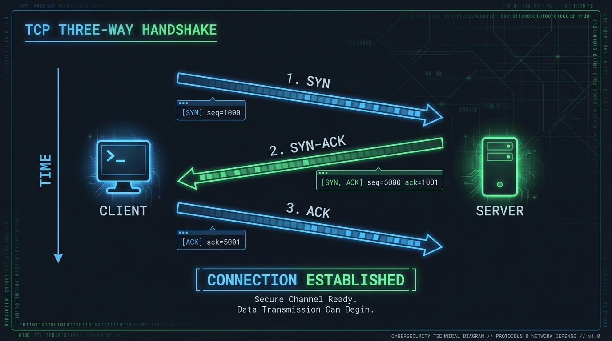<br><sub>TCP 3-Way Handshake</sub></td>
<td align="center">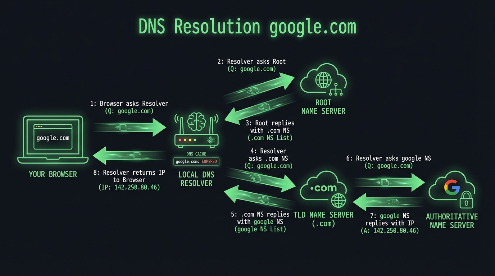<br><sub>DNS Resolution Flow</sub></td>
<td align="center">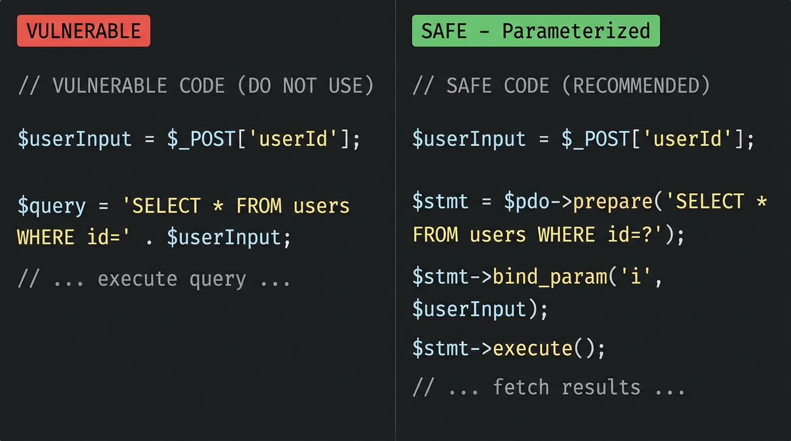<br><sub>SQL Injection</sub></td>
</tr>
<tr>
<td align="center">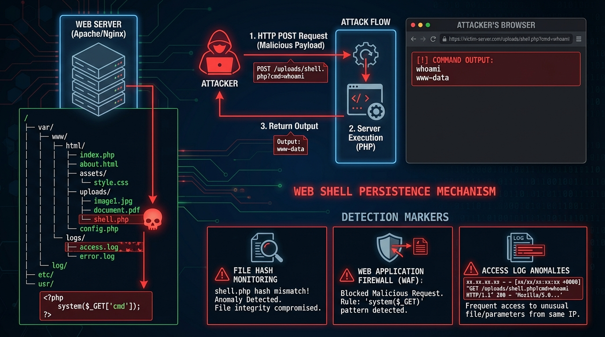<br><sub>Web Shell Lifecycle</sub></td>
<td align="center">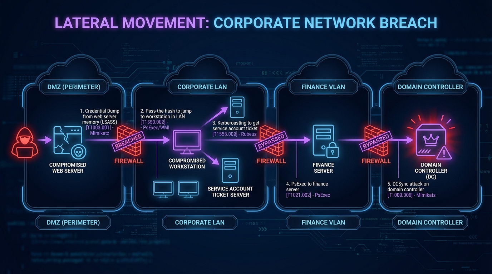<br><sub>Lateral Movement</sub></td>
<td align="center">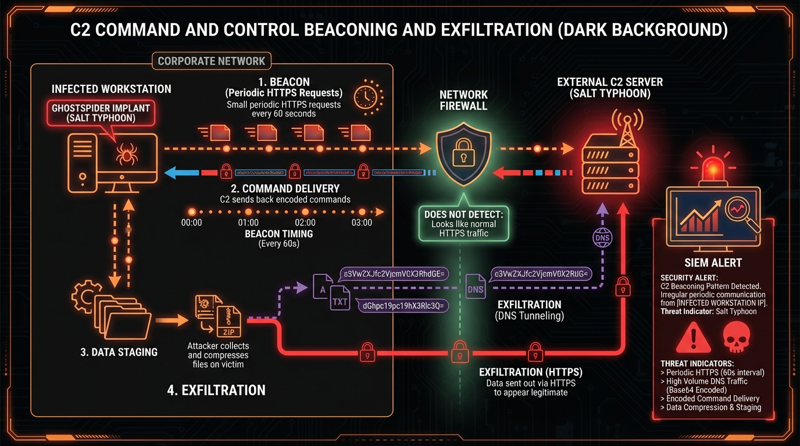<br><sub>C2 Beaconing</sub></td>
</tr>
<tr>
<td align="center">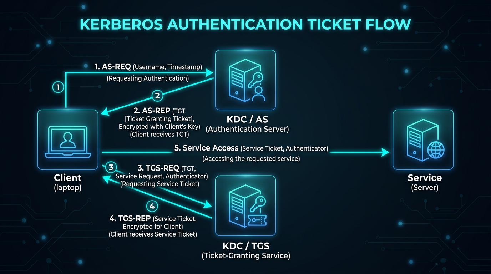<br><sub>Kerberos Flow</sub></td>
<td align="center">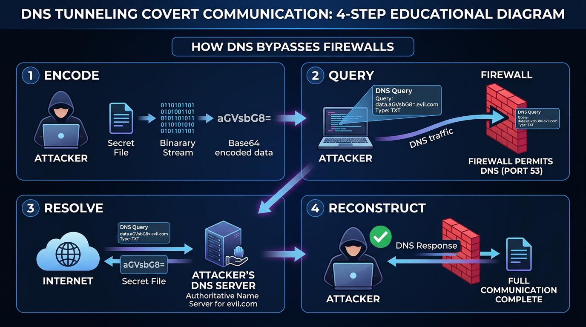<br><sub>DNS Tunneling</sub></td>
<td align="center">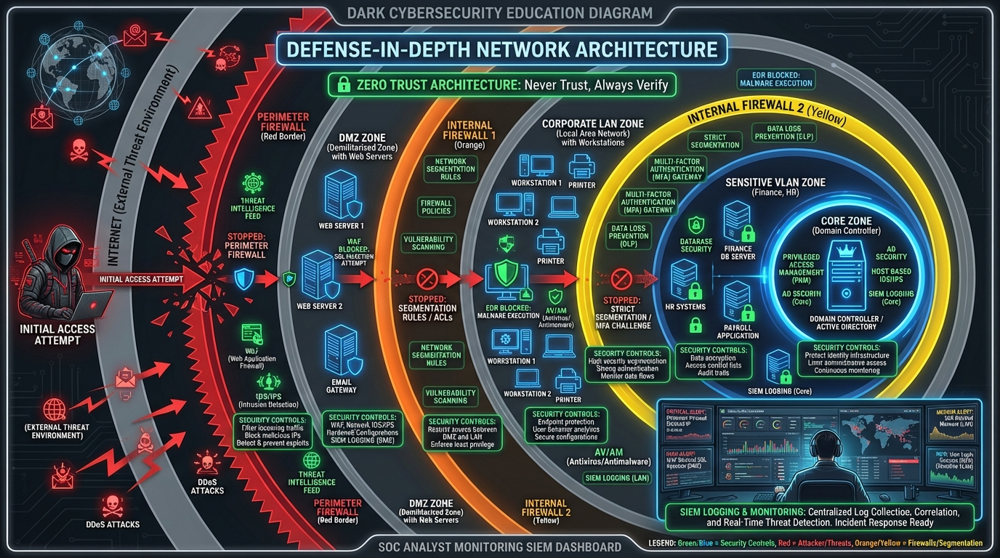<br><sub>Defense in Depth</sub></td>
</tr>
</table>

---

## Tech Stack

| Layer | Technology |
|-------|------------|
| Framework | React 18 + TypeScript |
| Build | Vite 5 |
| Styling | Tailwind CSS 3 + `@tailwindcss/typography` |
| Terminal | xterm.js 5 (`@xterm/xterm`) with fit & web-links addons |
| State | Zustand (persistent via `localStorage`) |
| Routing | React Router v6 |
| Visualizations | D3.js v7 |
| Icons | Lucide React |

---

## Getting Started

```bash
# Clone
git clone https://github.com/nmirson-ml/fsociety.git
cd fsociety

# Install
npm install

# Run
npm run dev
```

Open `http://localhost:5173` — no backend, no account needed, everything runs in the browser.

```bash
# Type check
npx tsc --noEmit

# Production build
npm run build
```

---

## Project Structure

```
fsociety/
├── public/
│   └── assets/images/          # 26 AI-generated concept diagrams
├── src/
│   ├── components/
│   │   ├── Terminal/
│   │   │   ├── Terminal.tsx    # xterm.js terminal instance
│   │   │   └── MissionPanel.tsx# Objective checklist + auto-hints
│   │   └── Layout/
│   ├── data/
│   │   ├── curriculum.ts       # All modules + lessons + XP + MITRE IDs
│   │   ├── lessonContent.ts    # Full HTML lesson content (keyed by slug)
│   │   └── lessonImages.ts     # Per-lesson image paths + tab overrides
│   ├── terminal/
│   │   ├── commandProcessor.ts # Routes input to command handlers
│   │   ├── commands/
│   │   │   ├── basic.ts        # help, clear, whoami, ls, cat, …
│   │   │   ├── recon.ts        # nmap, whois, dig, shodan, …
│   │   │   ├── exploit.ts      # sqlmap, hydra, metasploit stubs
│   │   │   └── advanced.ts     # mimikatz, psexec, crackmapexec, …
│   │   └── scenarios/
│   │       ├── index.ts        # getScenario(id) registry
│   │       ├── scenario-00-basics.ts
│   │       ├── scenario-01-dns-recon.ts
│   │       ├── scenario-02-web-app.ts
│   │       ├── scenario-03-persistence.ts
│   │       ├── scenario-04-lateral.ts
│   │       ├── scenario-05-soc.ts
│   │       └── scenario-06-terminal-basics.ts
│   ├── store/
│   │   └── progress.ts         # Zustand store — XP, completed objectives
│   └── pages/
│       ├── Home.tsx
│       ├── Curriculum.tsx
│       ├── LessonPage.tsx
│       ├── ModulePage.tsx
│       └── Lab.tsx
```

---

## Design Principles

- **No backend** — everything runs client-side. No auth, no server, just open and learn.
- **Attacker mindset first** — lessons explain *why* techniques work, not just *how* to run the tool.
- **MITRE-anchored** — every offensive technique links to a real ATT&CK technique ID.
- **Progressive difficulty** — each module builds on the last. Beginners start at OSI; experts end at nation-state TTPs.

---

<div align="center">

*"The best defenders are the ones who have thought like an attacker."*

</div>
